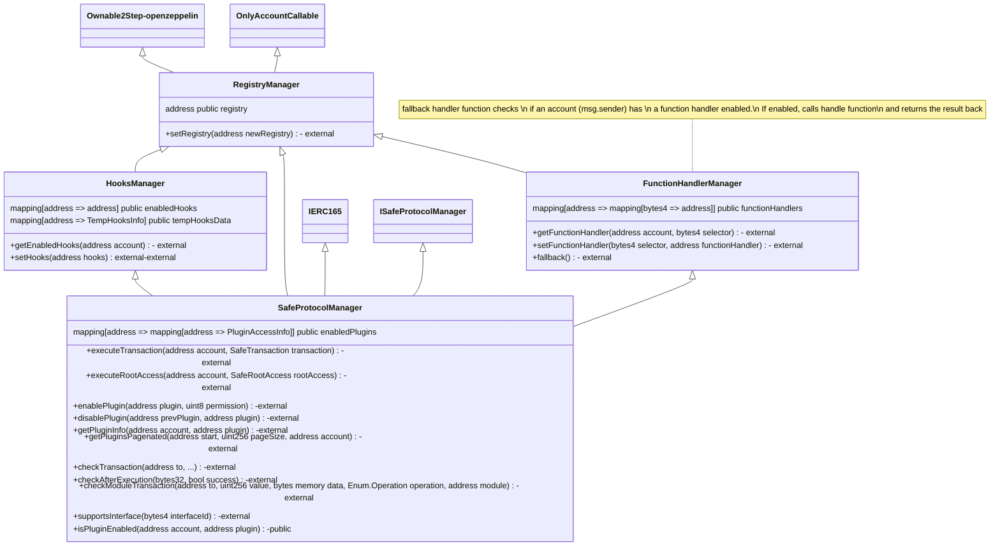
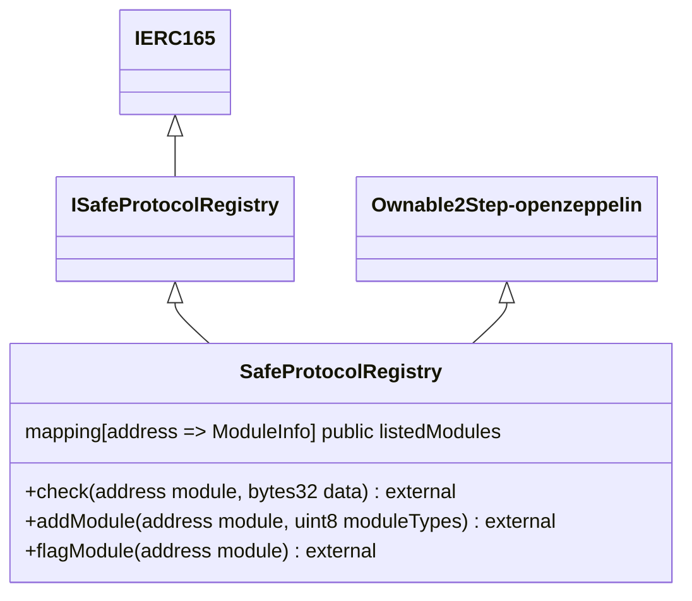
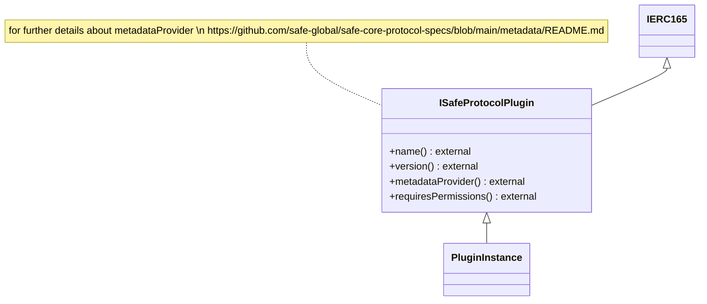
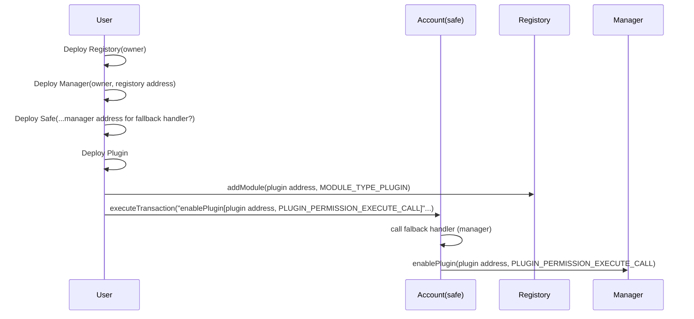
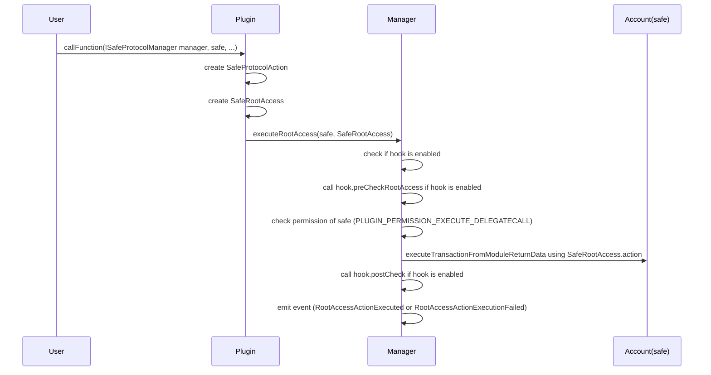

# Example project using safe-protocol

# safe protocol

[safe protocol whitepaper](https://github.com/safe-global/safe-core-protocol-specs)
[safe core protocol github repo](https://github.com/safe-global/safe-core-protocol)
[safe core demo](https://github.com/5afe/safe-core-protocol-demo/)

# safe protocol overviews

## Contract structures
### SafeProtocolManager

### SafeProtocolRegistry

### Plugin

## Contract interructions
### Enabling Plugin

manager.getPuginInfo(account address, plugin address) should return PLUGIN_PERMISSION_EXECUTE_CALL and SENTINEL_MODULES

### Execute trnsaction through Plugin

### Execute transaction through Hook
### Execute transaction through FunctionHandler